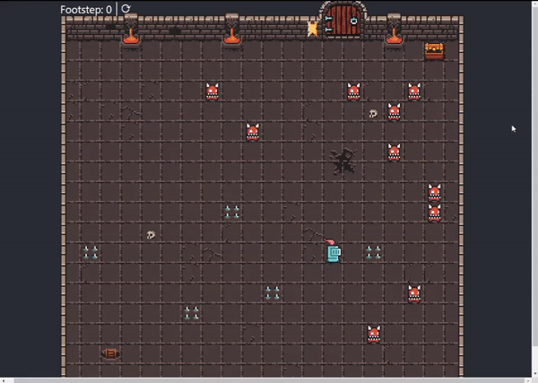

# Game Hero-Way

## 🚀 Why I developed this application

The Hero-Way game was developed using JavaScript, to evolve and learn more about the programming language, improving my programming logic skills and getting to know more features of JS.
 
## 💻 Project

The game consists of the hero dodging enemies and rescuing the treasure chest.

 Preview 

## 📝 License

This project is under the MIT license. See the file [LICENSE](LICENSE.md) for more details.
